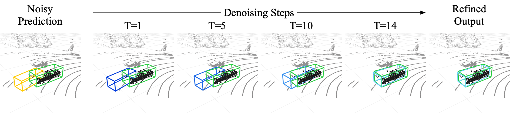

# DiffuBox: Refining 3D Object Detection with Point Diffusion

This is the official repo for

[**DiffuBox: Refining 3D Object Detection with Point Diffusion**](https://www.arxiv.org/abs/2405.16034) (NeurIPS 2024)

by Xiangyu Chen∗, Zhenzhen Liu∗, Katie Z Luo∗, Siddhartha Datta, Adhitya Polavaram, Yan Wang, Yurong You, Boyi Li, Marco Pavone, Wei-Lun Chao, Mark Campbell, Bharath Hariharan and Kilian Q. Weinberger \
*Equal Contribution



## Abstract

Ensuring robust 3D object detection and localization is crucial for many applications in robotics and autonomous driving. Recent models, however, face difficulties in maintaining high performance when applied to domains with differing sensor setups or geographic locations, often resulting in poor localization accuracy due to domain shift. To overcome this challenge, we introduce a novel diffusion-based box refinement approach. This method employs a domain-agnostic diffusion model, conditioned on the LiDAR points surrounding a coarse bounding box, to simultaneously refine the box's location, size, and orientation. We evaluate this approach under various domain adaptation settings, and our results reveal significant improvements across different datasets, object classes and detectors. 

## Citation

```
@article{chen2025diffubox,
  title={Diffubox: Refining 3d object detection with point diffusion},
  author={Chen, Xiangyu and Liu, Zhenzhen and Luo, Katie and Datta, Siddhartha and Polavaram, Adhitya and Wang, Yan and You, Yurong and Li, Boyi and Pavone, Marco and Chao, Wei-Lun Harry and others},
  journal={Advances in Neural Information Processing Systems},
  volume={37},
  pages={103681--103705},
  year={2025}
}
```

## Environment

```
conda env create -f environment.yml -n diffubox
conda activate diffubox
pip install git+https://github.com/cdiazruiz/ithaca365-devkit.git
cd OpenPCDet
python setup.py develop
```

## Datasets
We perform domain adaptation from [KITTI](https://www.cvlibs.net/datasets/kitti/) to [Lyft](https://woven.toyota/en/perception-dataset), [Ithaca365](https://ithaca365.mae.cornell.edu/) and [nuScenes](https://www.nuscenes.org/). 


* **KITTI**, **Ithaca365** and **nuScenes**: We follow the official dataset splits, which can be obtained through the official sources linked above. Note that for Ithaca365, we use the 40 traversals subset where 3D bounding box labels are available. Our codebase follows the KITTI format by default. Ithaca365 and nuScenes can be converted to this format using the [nuScenes devkit](https://github.com/nutonomy/nuscenes-devkit).

* **Lyft**: The data can be obtained from the [official source](https://woven.toyota/en/perception-dataset). We follow the splits and preprocessing used by the amazing work [Hindsight](https://github.com/YurongYou/Hindsight/tree/master). See the instructions [here](https://github.com/YurongYou/Hindsight/blob/master/data_preprocessing/lyft/LYFT_PREPROCESSING.md).


All datasets should be placed under `DiffuBox/OpenPCDet/data/`, organized as follows:

```
DiffuBox/ # root folder of this repository
    OpenPCDet/
        data/
            kitti/
                ImageSets/
                training/
                gt_database/
                ...
            lyft/
                ...
            ...
```

## Usage

### Diffusion Training

We provide trained diffusion model checkpoints below, which can be directly loaded in for detection refinement. If you would like to train one from scratch, follow the steps below:

#### Step 1: Object Generation

```
python gen_obj_shape.py --context-limit [context_limit] --dataset kitti --dataset-path [path_to_kitti] --out-dir [output_directory]
```

where `[path_to_kitti]` can look like `OpenPCDet/data/kitti`, under which one can find `training/velodyne`, `training/calib`, etc. This creates a diffusion training database by extracting ground truth objects and their surroundings within the context limit from the source domain training set.

#### Step 2: Diffusion Model Training

```
python train.py --dataset kitti --dataset-path [path_to_dataset_root] --class-name [class_name] --context-limit [context_limit] --outdir [outdir]
```

where `[path_to_dataset_root]` is the folder that contains all diffusion training datasets generated from `gen_obj_shape.py`, e.g. 

```
dataset_root/
    kitti_train_4/
        Car/
        ...
    ...
```

### Detection Refinement

#### Step 1: Training a Detector and Obtaining Detection Results

Detectors can be trained and tested using `OpenPCDet`, which is included in this repository. See the [official instructions](https://github.com/open-mmlab/OpenPCDet/blob/master/docs/GETTING_STARTED.md#training--testing) for more information.

Training a detector:

```
cd OpenPCDet/tools
./scripts/dist_train.sh [num_gpus_to_use] --cfg_file [cfg_file]
```

where `[cfg_file]` is the path to the detector config file, e.g. `cfgs/kitti_models/pointrcnn_xyz.yaml`

Obtaining detection results from the trained detector:

```
cd OpenPCDet/tools
./scripts/dist_test.sh [num_gpus_to_use] --cfg_file [cfg_file] --ckpt [detector_ckpt]
```

Note that for domain adaptation, `[cfg_file]` should be updated to match the target domain. This should generate a pickle file `results.pkl`, which can be passed in to the diffusion refinement script detailed below.

#### Step 2: Applying Diffusion Refinement

```
cd OpenPCDet/tools
python denoise_eval.py --dataset [dataset] --category [category] --det-path [det_path] --ckpt [ckpt] --save-dir [save_dir]
```

where `[dataset]` is the name of the dataset the detections were obtained from (one of `lyft`, `ithaca365` or `nuscenes`), `[category]` is the traffic participants class (one of `car`, `pedestrian` and `cyclist`), `[det_path]` is the path to the pickle file that contains the detections, `[ckpt]` is the path to the diffusion model checkpoint, and `[save_dir]` is the path to the folder to save the results (a `.pkl` file containing the refined detections and a `.txt` file containing the log).

## Checkpoints
All the checkpoints can be found following [this link](https://cornell.box.com/s/cqa3c6q16avtzc2lmyx94lm3xynwn5wd). It includes: 

* Main results: Diffusion models trained on KITTI's [car](https://cornell.box.com/s/i8p15n2av4wgctjgtwfy4wz093cqfgd5), [pedestrian](https://cornell.box.com/s/hhnjrdcqfq9nlww991wohbx5x8o82np9) and [cyclist](https://cornell.box.com/s/nsqyt1eg2x7sytdzgm83gglfloxbvbgj) classes using our default context limit 4.
* Ablation studies: Diffusion models trained on KITTI's car class using [context limit 2](https://cornell.box.com/s/z3c8x9hszov0sakzda9d1rar7mmo1w1u) and [context limit 6](https://cornell.box.com/s/fhr41qsksi5jgwdu9tutj0bgajou3w4a).
* Example detectors trained on KITTI

## Acknowledgement
This work is built upon the excellent open source codebases of [Elucidating the Design Space of Diffusion-Based Generative Models (EDM)](https://github.com/NVlabs/edm) and [OpenPCDet](https://github.com/open-mmlab/OpenPCDet).